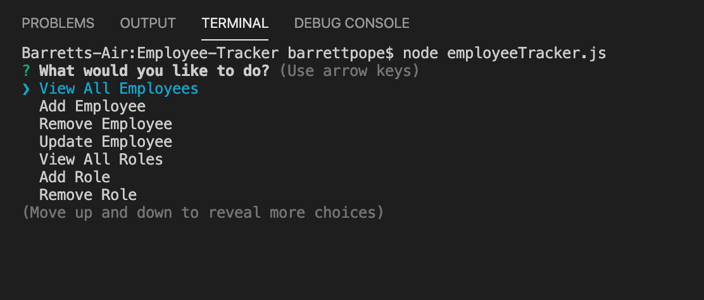
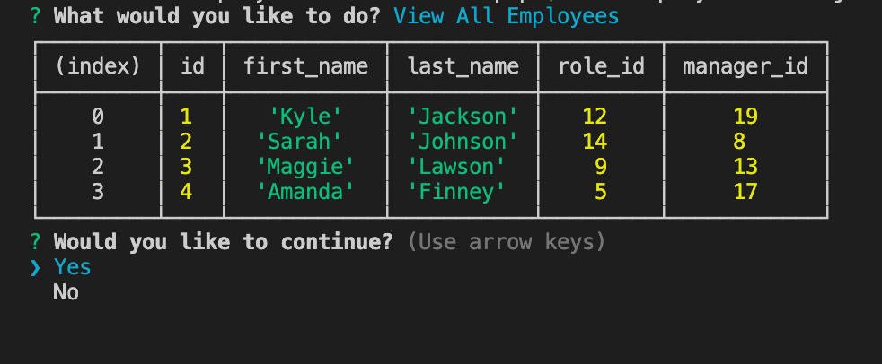

# Employee-Tracker

## Table of Contents
* [Description](#description)
* [Installation](#installation)
* [Usage](#usage)
* [License](#license)
* [Visuals](#visuals)
* [Demonstration](#demonstration)
* [Contributing](#contributing)
* [Support](#support)

## Description
Employee-Tracker is a command line application that keeps track of a company's employees using node, inquirer and MySQL.

## Installation
This application requires the following node packages:
* MySQL
* Inquirer
* Boxen

To install, run "npm install" in your Command Line System.

## Usage
To use this application, you must first run the MySQL data in either your Command Line System or by using MySQLWorkbench. Then, enter "employeeTracker.js" in your CLS and navigate through the prompts accordingly.

## License

## Visuals

## Demonstration

## Contributing
Pull requests are welcome. For major changes, please open an issue first to discuss what you would like to change. 

## Support
For questions, comments or concerns regarding the Employee-Tracker application, please email barrettpope94@gmail.com.